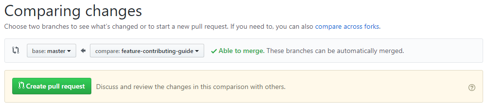
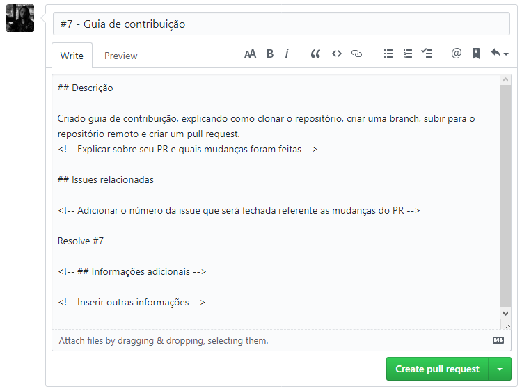
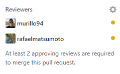
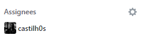

# Contribuindo com o projeto :globe_with_meridians:

## Clonando o repositório

Para contribuir com o projeto faça o clone do mesmo em sua máquina

```sh
# via HTTPS
git clone https://github.com/restaurante-popular-catolicasc/web.git

# via SSH
git clone git@github.com:restaurante-popular-catolicasc/web.git
```

Após clonar o repositório é necessário entrar na pasta do projeto

```sh
cd web
```

## Criando uma branch

Entrando na pasta do projeto, inicie uma nova branch e entre na mesma, é recomendando que a branch se inicie com o prefixo `feature-` e em seguida o nome da feature que será desenvolvida

```sh
# Substituir login-page pelo nome da feature a ser desenvolvida
git checkout -b feature-login-page
```

## Finalizando a feature

Ao finalizar a feature não esqueça de rodar alguns comandos para verificar se está tudo ok, sendo eles:

```sh
# O linter para garantir que o código está escrito de acordo com o padrão
yarn lint

# Os testes unitários com o índice de cobertura
yarn test:coverage

# O build para garantir que o projeto está sendo compilado corretamente
yarn build
```

## Enviando para o repositório remoto

Terminado de desenvolver sua feature e feito os commits com as alterações, é necessário subir sua branch para o repositório remoto

```sh
# Substituir feature-login-page pelo nome da branch que está sendo utilizada
git push --set-upstream origin feature-login-page
```

## Pull request

Feito isso a branch será enviada para o [repositório remoto](https://github.com/restaurante-popular-catolicasc/web) e será necessário abrir um [pull request](https://github.com/restaurante-popular-catolicasc/web/compare) para enviar a feature para a branch `master`



Ao criar o pull request é necessário dar um nome a ele, o recomendando é colocar o número referente a issue que está sendo feita e o nome da feature, como por exemplo _#1 - Tela de login_.

Também precisa ser escrito a descrição do que foi feito seguindo o template de pull request existente.



Não esqueça também de pedir para, pelo menos, duas pessoas fazerem o code review de suas alterações, para isso basta marcar elas no PR.



Feito tudo isso, agora é só clicar no **Create pull request** e aguardar o code review ser feito :wink:

### Deu ruim no code review e agora? :dizzy_face:

Não aprovaram seu pull request? Calma, não é o fim!

Basta você realizar as alterações necessárias e enviar novamente para a repositório remoto, mas fica esperto, agora é só rodar esse comando depois de ter commitado tudo:

```sh
# não precisa mais do --set-upstream nessa branch ;)
git push
```

Agora com tudo no repositório remoto é só esperar os reviewers verem que foi tudo acertado e aprovarem o PR!

### Quebrou o CI e não vai ser feito o merge, acabou de vez? :scream:

Não! Ainda não acabou de vez! Basta você abrir o CI e ver o que deu errado e corrigir igualzinho fez no tópico acima!

### Tudo pronto e agora?

Foi feito o review, o CI passou e tá tudo pronto pra ir pra `master`? Perfeito! Basta marcar o seu líder e ele vai aprovar o PR para você.


